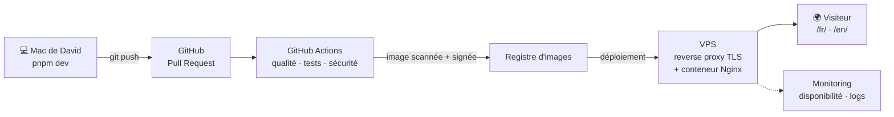

# Architecture

Vue d'ensemble du projet. Les décisions détaillées sont dans [`docs/adr/`](adr/).

## Du code au visiteur



| Brique                | Rôle                                                          | Étape           |
| --------------------- | ------------------------------------------------------------- | --------------- |
| Astro (site statique) | Transformer `src/` en HTML/CSS dans `dist/`                   | 4-5 ✅ en cours |
| Git + GitHub          | Historique, revue par Pull Request, branche `main` protégée   | 6               |
| GitHub Actions        | Lint, tests, SAST, SCA, secrets, build, scan de l'image, DAST | 7               |
| Docker + Nginx        | Servir `dist/` avec des en-têtes de sécurité                  | 7-8             |
| VPS                   | Héberger le conteneur, TLS, pare-feu                          | 8               |
| Monitoring            | Disponibilité, erreurs, alertes                               | 9               |

## Organisation des dossiers

```
portfolio/
├── design/maquette/     Maquette validée : la référence visuelle (non déployée)
├── docs/
│   ├── architecture.md  Ce document
│   └── adr/             Architecture Decision Records : une décision = un fichier
├── public/              Fichiers copiés tels quels (favicon, robots.txt)
├── src/
│   ├── components/      Morceaux d'interface réutilisables (étape 5)
│   ├── content/         Projets, expériences, formations en Markdown (étape 5)
│   ├── i18n/ui.ts       Traductions de l'interface FR / EN
│   ├── layouts/         Squelette HTML commun (<head>, polices, CSS)
│   ├── pages/           Une page = une URL ; [lang]/ génère /fr/ et /en/
│   └── styles/          tokens.css (identité visuelle) + global.css (base)
├── astro.config.mjs     Configuration Astro (i18n, build)
├── package.json         Scripts et dépendances
├── pnpm-lock.yaml       Versions exactes des dépendances (versionné)
├── pnpm-workspace.yaml  Règles de sécurité pnpm
└── tsconfig.json        TypeScript en mode strict
```

## Principes

1. **Statique d'abord** : pas de serveur applicatif, pas de base de données.
2. **Aucune ressource tierce** : polices et icônes sont intégrées au build.
3. **CSP stricte possible** : ni script ni style en ligne générés.
4. **Contenu séparé du code** : on ajoute un projet sans toucher aux composants.
5. **Tout est automatisé et vérifié** avant d'arriver en production.
